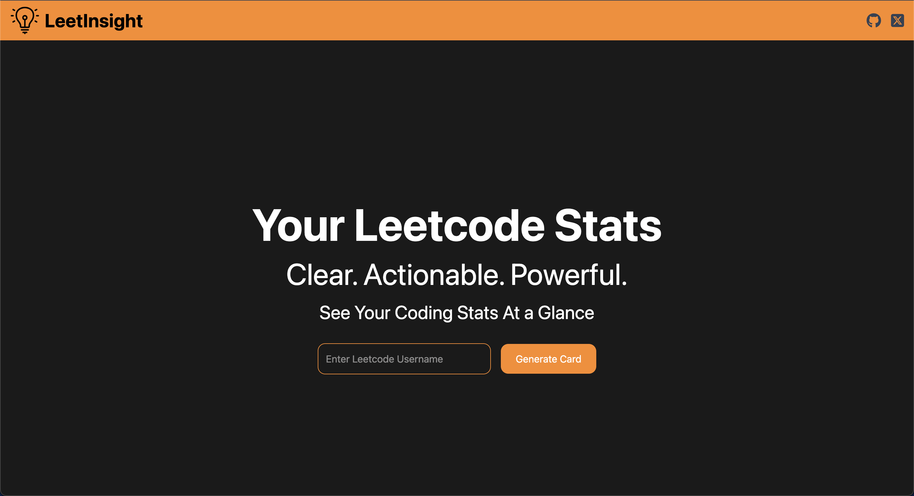
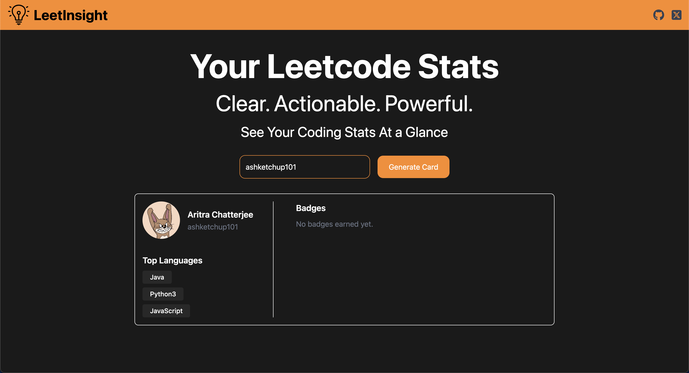

# LeetInsight: Leetcode Profile Card Generator

## Introduction
This LeetCode Profile Card Generator is a web app that fetches LeetCode stats via GraphQL, processes them on the backend, and displays a clean, downloadable profile card for easy sharing on platforms like LinkedIn, GitHub, and portfolios.

## Features
- Real-time LeetCode stats via GraphQL
- Clean and responsive card design
- Perfect for portfolios, GitHub READMEs, and LinkedIn
- Note: Download and share functionality is not available in this version (v1). These features will be added in upcoming updates.

## Tech Stack
- Frontend: React.js, TailwindCSS
- Backend: Node.js, Express.js 
- Data Source: LeetCode GraphQL API
- Image Rendering: HTML-to-image (planned for future)

## Usage
- Enter your LeetCode username.
- Click "Generate Card".
- Wait a moment while the app fetches and processes your stats.
- View your live LeetCode profile card.
- (Download and share features coming soon!)